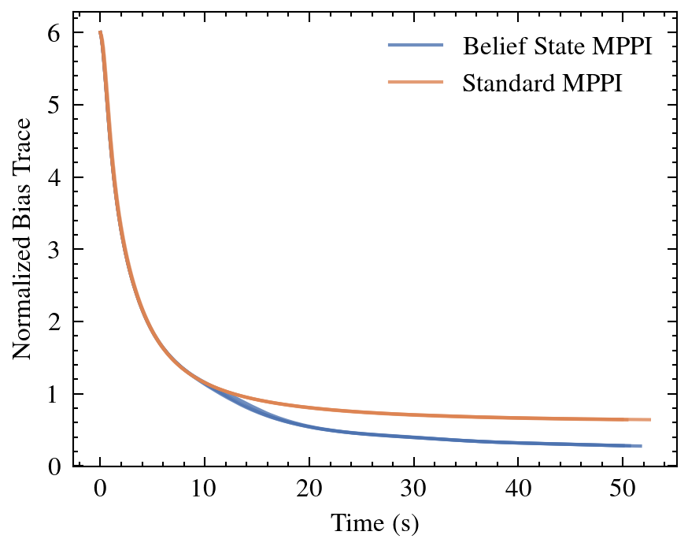

# 🌊 CoUGARs Active Factor Graph Odometry

[](https://github.com/cougars-auv/coug_active_fgo/actions/workflows/ros2_build_and_test.yml)
[](https://github.com/cougars-auv/coug_active_fgo/actions/workflows/docker_build.yml)
[](https://results.pre-commit.ci/latest/github/cougars-auv/coug_active_fgo/main)
[](https://codecov.io/gh/cougars-auv/coug_active_fgo)

## 🚀 Get Started

> **Prerequisites:** 64-bit Linux, free disk space (5+ GB recommended).

- Install [Docker](https://www.docker.com/get-started/).

- Clone the `coug_active_fgo` repository.

  ```bash
  git clone https://github.com/cougars-auv/coug_active_fgo.git
  ```

- Enable GUI forwarding, build the Docker image, and launch the demo container.

  ```bash
  xhost +local:docker
  cd coug_active_fgo/demo && docker compose up
  ```

## 📊 Results

### Challenges

There were several challenging aspects of this project, including Nav2 integration debugging, pivoting to a downstream HoloOcean controller for dynamics modeling (“nav2_mppi_controller” does not easily support custom dynamics plugins, contrary to my initial research), and deriving and verifying the Jacobeans for the EKF predict and update steps in the BeliefStateCritic.

The two most challenging aspects, however, were (1) getting the code to run fast enough for real-time control, and (2) effectively tuning the trace heuristic. Even using OpenMP for CPU parallelism and performing extensive pre-computation, I was only able to run 250 rollouts of 15 steps of 0.1 seconds executing at 10 Hz on my lab computer with all 32 CPUs maxed out at 100%. Additionally, the full unnormalized covariance trace was dominated by the growing positional uncertainty inherent to dead reckoning and skewed by mixed units. To maximize the heuristic's impact over just a 1.5-second horizon, I chose to score the trajectory using the normalized hidden IMU bias covariances instead.

### Experiments & Validation

To isolate and validate the performance of the BeliefStateCritic, I ran 6 missions – 3 with only the BeliefStateCritic enabled, and 3 with it disabled – and monitored the normalized IMU bias covariance trace over time. The BeliefStateCritic effectively and consistently identified uncertainty-reducing maneuvers as shown in the plot below.

<br>

<p align="center">
  
</p>

<p align="center">
  <em>Fig. 1. Normalized IMU bias covariance trace with versus without the BeliefStateCritic.</em>
</p>

<br>

The demo demonstrates the BeliefStateCritic encouraging excitation-rich maneuvers, such as varying acceleration and yaw, as the AUV navigates to 3 waypoints using the MPPI controller.

### AI Use Disclosure

Gemini 3.1 Pro was used as a collaborative partner for initial brainstorming, and Claude Opus 4.6 was used for code simplification and speed suggestions.

## 💡 Elevator Pitch

### Problem
Effective underwater navigation requires balancing both progressing toward a goal and maintaining an accurate state estimate. For AUVs relying extensively on internal sensors (IMU, DVL, etc), excitation – changes in acceleration and velocity – can often improve state estimate accuracy. This conflicts with the goal-directed approach of many AUV path planners and controllers.

Finding the optimal trajectory that balances goal achievement with state estimation accuracy is a POMDP. However, through extending our state vector to include the covariance matrix of our state estimate, we can transform the problem into an observable belief-state MDP. This is a common strategy in Active SLAM, but results in a high degree of dimensionality. Calculating an exact closed-loop solution across all those continuous dimensions raises some serious computational challenges, especially in real-time on limited AUV hardware.

### Proposed Solution Approach
To solve this continuous-time MDP in real-time, I plan to implement an open-loop Model Predictive Path Integral (MPPI) controller, which is the continuous-time version of the Multiforecast Model Predictive Control (MMPC) approach described in section 9.9.3 of the textbook. During each planning cycle, the MPPI algorithm will sample a large number of stochastic trajectory rollouts, evaluate them against a heuristic that penalizes both deviation from the goal and the trace of the covariance matrix, and execute the first step of the averaged optimal control sequence. 

<br>

<p align="center">
  
</p>

<p align="center">
  <em>Fig. 1. Simplified Belief State MPPI visualization.</em>
</p>

<br>

To simplify the scope of the project, I will make use of the HoloOcean simulator and Nav2’s CPU-optimized “nav2_mppi_controller” class available in ROS 2. Specifically, I plan to:
1) Integrate Nav2’s “nav2_mppi_controller” with the HoloOcean simulator
2) Implement a new AUV dynamics plugin (based on a simplified Fossen model) to accurately model physical state propagation during rollouts
3) Implement a new heuristic plugin to simulate uncertainty propagation and penalize trajectories based on the trace of the resulting covariance matrix, forcing the the controller to favor excitation-rich action sequences
4) Benchmark the resulting algorithm’s uncertainty growth over a set waypoint sequence against a baseline MPPI controller

## 🤝 Contributing

- **Create a Branch:** Create a new branch using the format `name/feature` (e.g., `nelson/repo-docs`).

- **Make Changes:** Develop and debug your new feature. Add good documentation.

  > If you need to add dependencies, update the `package.xml`, `Dockerfile`, `cougars.repos`, or `dependencies.repos` in your branch and test building the image locally. The CI will automatically build and push the new image to Docker Hub upon merge.

- **Sync Frequently:** Regularly rebase your branch against `main` (or merge `main` into your branch) to prevent conflicts.

- **Submit a PR:** Open a pull request, ensure required tests pass, and merge once approved.

## 📚 Citations

Please cite our relevant publications if you find this repository useful for your research:

### CoUGARs
```bibtex
@misc{durrant2025lowcostmultiagentfleetacoustic,
  title={Low-cost Multi-agent Fleet for Acoustic Cooperative Localization Research},
  author={Nelson Durrant and Braden Meyers and Matthew McMurray and Clayton Smith and Brighton Anderson and Tristan Hodgins and Kalliyan Velasco and Joshua G. Mangelson},
  year={2025},
  eprint={2511.08822},
  archivePrefix={arXiv},
  primaryClass={cs.RO},
  url={https://arxiv.org/abs/2511.08822},
}
```
